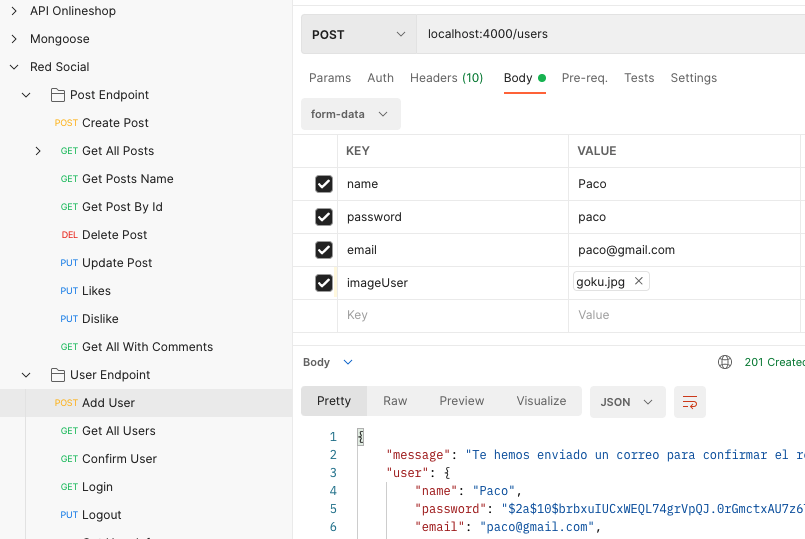
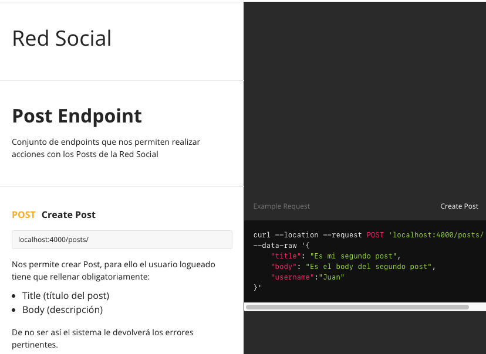

#Acerca del Proyecto

## Proyecto Red Social

En este proyecto se ha desarrollado una simulación de una Red Social.

## Tecnologías utilizadas

\_El Proyecto se ha desarrollado con las siguientes tecnologías:

- JavaScript
- [Node.js](https://nodejs.org/en/)
- [Express.js](https://www.npmjs.com/package/express)
- [MongoDB](https://docs.mongodb.com/manual/)
- [Mongoose](https://mongoosejs.com/)
- [Nodemon](https://www.npmjs.com/package/nodemon)
- [Postman](https://www.postman.com/)
- [Heroku](https://dashboard.heroku.com/login)
- [Multer](https://www.npmjs.com/package/multer)

## Cómo empezar - Instalación

1. Clonar el repositorio.

```
https://github.com/Vincecoorp21/Social-Network-Mongoose/tree/main
```

2. Instalar dependencias.

```
npm i
```

3. Rellenar variables de autentificación en el archivo .env.example.

## Mapa de acción del Proyecto.

1. Definir el organigrama.

La base de datos de la red social se compone de 3 tablas:

> - Tabla Users
> - Tabla Posts
> - Tabla Comments

2. Crear los Endpoints de las Consultas.

- Posts

> - CRUD Posts (el usuario tiene que estar autenticado para poder hacerlo.)
> - Endpoint para buscar un post por nombre y por id.
> - Validación completa a la hora de crear un post, si no rellena todos los campos (excepto la imagen) no permite la creación del mismo.
> - Se ha implementado el middleware Multer para añadir una imagen del post, tanto al actualizar como al crear.
> - Like & Dislike de un post.
> - Endpoint para traer toda la info relacionada con ese post(post, usuario, comentarios, likes) y con una paginación que nos muetsre 10 por página.

- Users

> - Registro y confirmación de usuario (bcrypt & Nodemailer).
> - Loguear y desloguear al usuario.
> - Se ha implementado la validación de todos los campos (excepto la imagen) para poder dar de alta un usuario nuevo.
> - Posibilidad de tener Followers y seguir a otros Usuarios.
> - Endpoint para buscar un usuario por nombre & ID.
> - Endpoint que nos muestre el usuario conectado, los posts y el nñúmero de followers que tiene.

- Middelwares utilizados.

> - Multer -> Implementa imágenes en Post y Usuario.
> - Validación errores en Usuarios y Posts.
> - Autenticación de usuarios (JWT), autoría de posts (isAuthor), role de admin (isAdmin).

- Documentación de Postman.

> - Puedes acceder a la documentación de Postman dónde nos explican todos los endpoints creados a través de: https://documenter.getpostman.com/view/21174543/Uz5KkE6d

## Consulta de la BBDD a través de Heroku.

Puedes consultar el proyecto en el siguiente enlace: https://redsocial-mongoose.herokuapp.com/

## Preview


)

## Author

👤 **Vince BC**

- Twitter: [@VinceTrend](https://twitter.com/VinceTrend)
- Github: [@Vincecoorp21](https://github.com/Vincecoorp21)
- Linkedin:[@vibarcar](https://www.linkedin.com/in/vibarcar/)

This project was developed By [Vicente Barberá - Vince BC -](https://github.com/Vincecoorp21)
